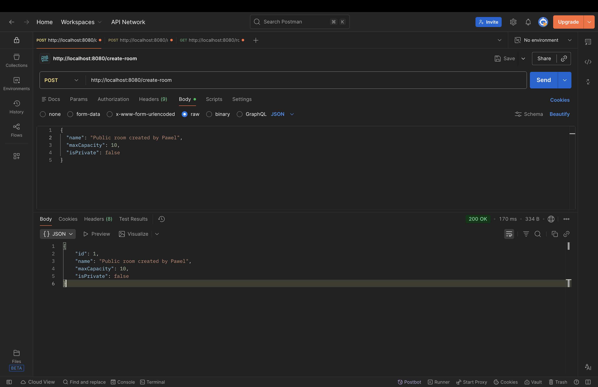
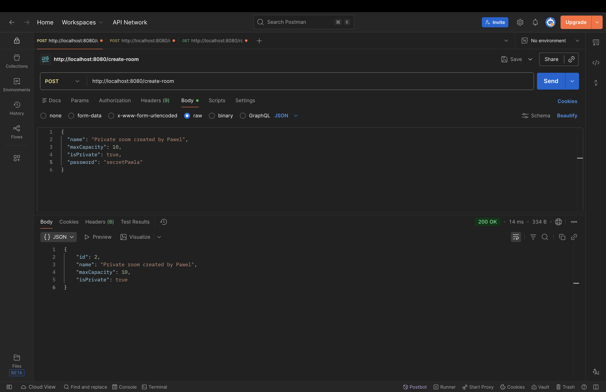
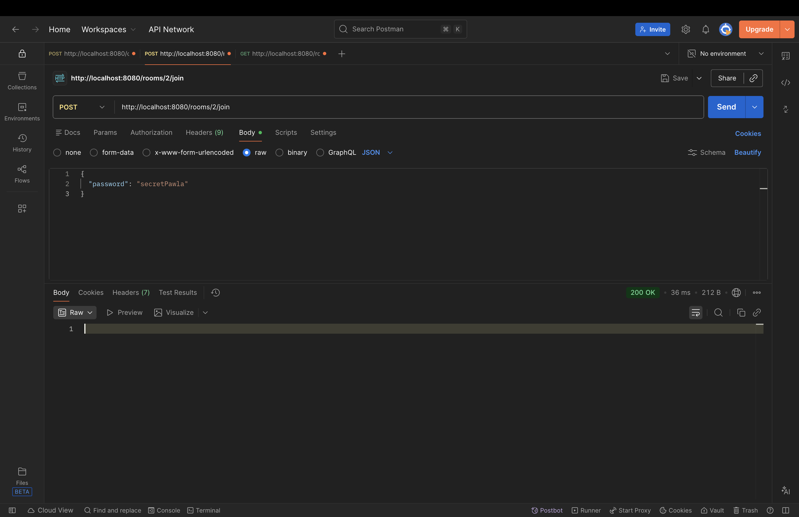
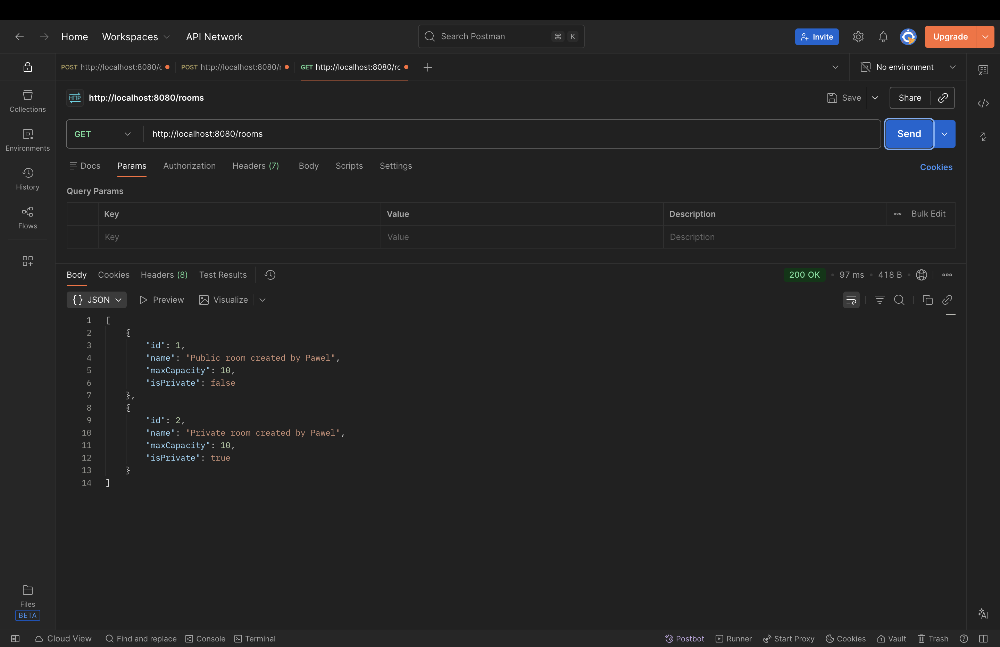

## :bookmark_tabs: About This Project
Chatter is a real-time chat application. This repository contains the **backend section** of the project, responsible for data storage, business logic, WebSocket messaging, and Kafka-based message streaming.

## :hammer_and_wrench: Used Technologies
* Java
* Spring Boot
* Spring Data JPA / Hibernate
* Spring WebSocket (STOMP)
* Apache Kafka
* H2 Database
* Gradle (Kotlin DSL)
* Lombok

## :camera: Screenshots
Create public room
:-------------------------:

Create private room      |  Join private room
:------------------------:|:-------------------------:
  |  

Get rooms
:-------------------------:

